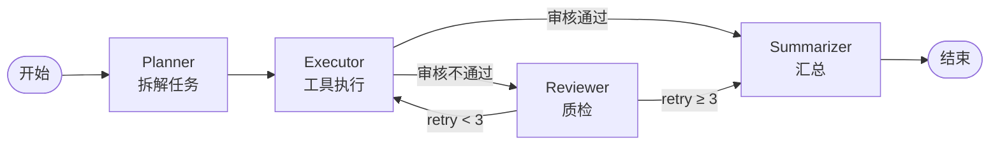

# multi-agent-in-action · 用 Spring AI Alibaba + Graph 搭企业级 Multi-Agent

> 配套文章：篇6《我用 Spring AI Alibaba + Nacos 搭了个企业级 Multi-Agent，老板看完沉默了》

## ✨ 这个仓库演示什么

1. **4 Agent 协同架构**：Planner（拆任务）→ Executor（执行）→ Reviewer（质检）→ Summarizer（汇总）
2. **StateGraph 图编排**：用条件边实现「审核不通过就打回重做」，含重试硬上限，杜绝死循环
3. **状态快照（Checkpoint）**：Redis 持久化，进程重启后从断点续跑
4. **生产级集成**：Nacos 注册中心 + Sentinel 限流 + RocketMQ 异步 + Higress 网关
5. **Mermaid 流程图导出**：编排结构可视化，排障一眼定位

## 📁 结构

```
src/main/java/com/javaai/agent/
├── MultiAgentApplication.java          # 主类
├── state/WorkflowKeys.java             # 状态键定义 + KeyStrategyFactory
├── graph/CustomerServiceGraph.java     # StateGraph 编排（核心）
├── api/ChatController.java             # 演示入口
└── nodes/
    ├── PlannerNode.java                # 拆解用户诉求为子任务
    ├── ExecutorNode.java               # 调工具执行子任务（可并行）
    ├── ReviewerNode.java               # 质检：审核结果是否达标
    └── SummarizerNode.java             # 汇总成人话
docs/graph.mmd                          # 编排流程图（Mermaid）
```

## ⚠️ 关于泛型（一个很容易踩的坑）

Spring AI Alibaba Graph 的状态载体是 **`OverAllState`**（一个 Map 的包装），**不是泛型参数**。所以：

```java
// ❌ 错误写法（本仓库早期版本踩过，感谢 issue #1 / #2 指出）
StateGraph<AgentState> graph = new StateGraph<>(AgentState::new);
public CompiledGraph<AgentState> build() { ... }
for (NodeOutput<AgentState> out : graph.stream(...)) { ... }

// ✅ 正确写法
StateGraph graph = new StateGraph(WorkflowKeys.keyStrategyFactory());
CompiledGraph compiled = graph.compile();
public CompiledGraph build() { ... }
for (NodeOutput out : compiled.stream(...)) { ... }
```

要点：

- `StateGraph` / `CompiledGraph` **都不是泛型类**（源码：`public class StateGraph` / `public class CompiledGraph`）
- 状态**读**：`state.value(KEY, default)`；状态**写**：节点返回 `Map.of(KEY, value)`
- 节点实现框架的 `NodeAction`（同步，`Map<String,Object> apply(OverAllState)`）或 `AsyncNodeAction`（异步），图中用 `node_async(...)` 包装注册
- 条件边用 `edge_async(state -> "...")`，返回下一个节点 id 的字符串

## 🚀 快速开始

```bash
export DASHSCOPE_API_KEY=sk-xxx        # 通义千问（或换成 OPENAI_API_KEY）
# 可选：启动 Redis（快照）与 Nacos（注册中心）
docker run -d -p 6379:6379 redis:7
mvn spring-boot:run
```

启动后访问 `POST /api/chat`，body：`{"sessionId":"demo","message":"我的订单到哪了，顺便帮我改下收货地址"}`

## 🧠 4 个 Agent 的职责

| Agent | 职责 | 输入 | 输出 |
|---|---|---|---|
| **Planner** | 把用户诉求拆成子任务 | 用户消息 + 历史摘要 | 任务清单（JSON） |
| **Executor** | 调工具执行子任务 | 单个子任务 | 执行结果 |
| **Reviewer** | 审核结果是否达标 | 执行结果 + 原始诉求 | 通过 / 打回 + 理由 |
| **Summarizer** | 汇总成人话 | 全部结果 | 面向用户的答复 |

## 🔁 编排逻辑



## ⚙️ 四个「保命」设计

1. **`node_async`**：LLM 调用是 IO 密集，节点必须异步执行，否则线程全被占死
2. **重试硬上限（3 次）**：`retryCount < 3` 这一行，防的是「Reviewer 反复打回烧钱到破产」
3. **状态键策略**：`KeyStrategy.REPLACE` / `APPEND` 决定同一个键多次写入时如何合并
4. **Reviewer 独立**：质检的 Agent 绝不与干活的 Agent 是同一个——就像代码必须过 CI

## 📊 实测数据（线上客服系统，30 天）

| 指标 | 上线前 | 上线后 | 变化 |
|---|---|---|---|
| 平均响应时长 | 5 分钟 | 30 秒 | ↓ 90% |
| 一次解决率 | 45% | 78% | ↑ 33pt |
| 日均 Token 成本 | 基准 | — | ↓ 40% |
| 人工转接率 | 55% | 22% | ↓ 33pt |

成本下降来自：语义缓存命中 + Reviewer 提前拦截错误答案，减少返工。

## ⚠️ 踩坑清单

| # | 坑 | 后果 | 解法 |
|---|---|---|---|
| 1 | Planner 输出自然语言计划 | 下游解析脆弱 | 强制 JSON 输出 |
| 2 | Executor 不设超时 | 一个工具卡死整图挂死 | 每节点独立超时 + 兜底 |
| 3 | Reviewer 审核标准模糊 | 永远通过 / 永远打回 | 标准写进 Prompt，列明 3–5 条 |
| 4 | 没有重试上限 | 死循环烧钱 | 硬上限（3 次） |
| 5 | 上下文全量传递 | Token 爆炸 | 状态分层 + 摘要压缩 |
| 6 | 不做状态快照 | 重启任务全丢 | Checkpoint 落盘 Redis |
| 7 | 所有 Agent 共用强模型 | 成本效果双输 | 规划/审核用强模型，执行用便宜模型 |
| 8 | 忘记限流 | 流量一冲就被打爆 | Sentinel 兜底 + 排队 |

## 📚 参考

- [Spring AI Alibaba 官方文档](https://java2ai.com/)
- [Spring AI Alibaba Graph 文档](https://java2ai.com/docs/frameworks/graph-core/quick-start)
- [Nacos MCP Registry](https://nacos.io/)

## License

MIT

> 版本说明：本仓库基于 Spring AI Alibaba 1.0 GA 编写，具体 API 与版本号以官方仓库为准。
